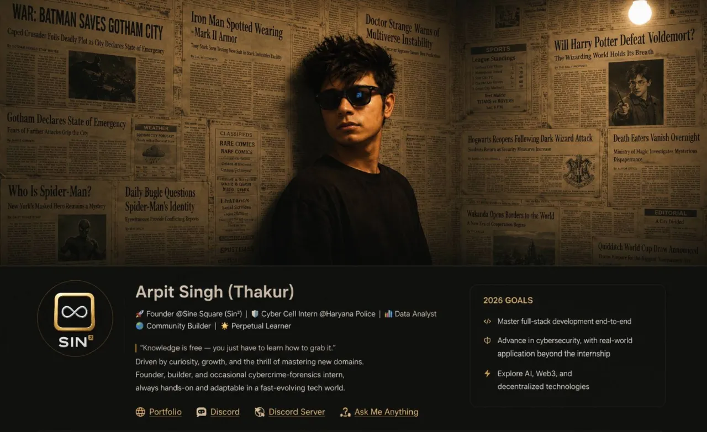

<!-- Banner -->

  

<h1 align="center">Arpit Singh (Thakur)</h1>

🚀 <b>Founder @ Sine Square (Sin²)</b> •
🛡️ Cyber Cell Intern •
📊 Data Analyst •
🌍 Community Builder •
🤖 Full-Stack Developer

  <i>"Knowledge is free — you just have to learn how to grab it."</i>

  
  
  

---

# 🧐 About Me

- 🛡️ **Cyber Cell Intern, Haryana Police (CyberCrime ACP Office, Gurugram)** — Hands-on experience in cybercrime investigation, digital forensics, and incident response.
- 📊 **Data Analyst** — Skilled in SQL, Python, Power BI, and Excel with practical experience cleaning and analyzing real-world datasets.
- 🎮 **Community & Esports Builder** — Founded **Indian Games Club**, co-founded **C69 Esports**, and led **League Operations at Trident Gaming**.
- 🤖 **Developer** — Building Discord bots since **2019**, currently focused on **React, Node.js, TypeScript, AI integrations, and Full-Stack Development**.
- 🔬 **Researcher** — Explored AI-driven cybersecurity and human decision-making in *AI vs Humans*.
- 🎓 **B.Sc. Physics & Mathematics** — Raja Mahendra Pratap Singh State University.
- 🌿 Outside tech, I enjoy football, taekwondo, roller skating, travelling, and learning new things.

---

# 📬 Contact Me

- 🌐 **Portfolio:** https://thakur.snapz.dev
- 💬 **Discord:** https://discord.com/users/960226887580397580
- 🌍 **Discord Server:** https://discord.com/invite/5WV5gffw9A
- ❓ Ask me anything — I'm always open to conversations and collaborations.

---

# 🥅 2026 Goals

- 🚀 Master Full-Stack Development
- 🔐 Advance in Cybersecurity
- 🤖 Build AI-powered applications
- 🌐 Explore Web3 & Decentralized Technologies
- 📚 Learn something new every day

---

<picture>
  <source
    media="(prefers-color-scheme: dark)"
    srcset="https://raw.githubusercontent.com/platane/snk/output/github-contribution-grid-snake-dark.svg"
  />
  <source
    media="(prefers-color-scheme: light)"
    srcset="https://raw.githubusercontent.com/platane/snk/output/github-contribution-grid-snake.svg"
  />
  
</picture>

---

# 💻 Skills & Technologies

---

# 🌐 Connect with Me

